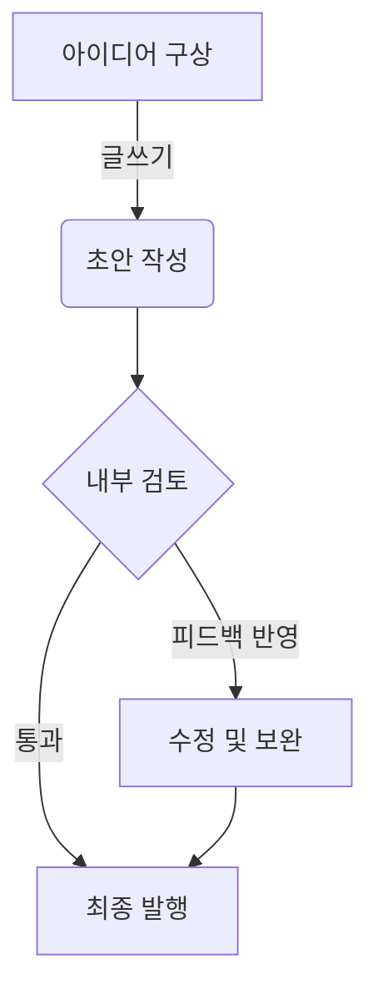

# Astro 블로그 속도 최적화: 이미지와 마크다운, 이렇게 관리하세요

Astro는 '느린 웹사이트는 과거의 유물'이라고 선언하듯, 기본적으로 매우 뛰어난 성능을 자랑합니다. 하지만 우리가 추가하는 이미지와 마크다운 콘텐츠를 어떻게 다루느냐에 따라 그 잠재력을 100% 발휘할 수도, 혹은 발목을 잡을 수도 있습니다.

블로그의 로딩 속도는 방문자의 첫인상을 결정하고, 검색 엔진 순위(SEO)에도 직접적인 영향을 미치는 매우 중요한 요소입니다. 오늘은 당신의 Astro 블로그를 한 단계 더 빠르게 만들어 줄 실용적인 이미지 및 마크다운 관리 전략을 공유합니다.

## 1. 이미지 최적화: 웹사이트 속도의 주범이자 해결사

고품질 이미지는 콘텐츠의 매력을 더하지만, 최적화되지 않은 이미지는 로딩 속도를 저해하는 가장 큰 원인입니다. 아래 전략들을 통해 이미지를 '문제'가 아닌 '자산'으로 만들어보세요.

### 가. 차세대 포맷 WebP 적극 활용하기

- **JPEG**: 사진처럼 다채로운 색상의 이미지에 적합합니다.
- **PNG**: 투명 배경이 필요하거나 선명한 로고, 아이콘에 사용됩니다.
- **WebP**: **가장 추천하는 포맷입니다.** JPEG와 PNG의 장점을 결합하여, 더 작은 파일 크기로 더 높은 품질을 제공합니다. 대부분의 최신 브라우저에서 지원되므로, 특별한 이유가 없다면 WebP를 기본으로 사용하는 것이 좋습니다.
- **SVG**: 해상도와 무관하게 항상 선명해야 하는 로고, 아이콘에 최적입니다.

### 나. 이미지 사이즈 다이어트 및 반응형 처리

- **불필요한 크기 줄이기**: 블로그 본문 폭이 800px인데 4000px짜리 원본 이미지를 그대로 올리는 것은 트래픽 낭비입니다. 이미지를 업로드하기 전에, 웹사이트에 표시될 크기에 맞춰 미리 리사이징하는 습관을 들이세요.
- **Astro의 `<Image />` 컴포넌트 활용**: Astro v3.0 이상부터는 `astro:assets`의 `<Image />` 컴포넌트를 사용하여 이미지를 최적화할 수 있습니다. 이 컴포넌트는 자동으로 이미지를 WebP와 같은 최신 포맷으로 변환하고, 다양한 화면 크기에 맞는 `srcset`을 생성하여 반응형 이미지를 손쉽게 구현해줍니다.

```astro
// src/pages/post.astro (예시)
---
import { Image } from 'astro:assets';
import myImage from '../assets/my-image.jpg'; // src/assets 폴더에 이미지 저장
---
<Image src={myImage} alt="이미지에 대한 설명" widths={[400, 800]} sizes="(max-width: 600px) 400px, 800px" format="webp" />
```

### 다. 지연 로딩(Lazy Loading)으로 초기 로딩 속도 확보

페이지가 처음 로드될 때 화면에 보이지 않는 이미지까지 한 번에 불러올 필요는 없습니다. `loading="lazy"` 속성은 사용자가 스크롤하여 이미지가 뷰포트에 가까워졌을 때만 해당 이미지를 로드하도록 하는 표준 기술입니다. Astro의 `<Image />` 컴포넌트는 이를 자동으로 처리해줍니다.

## 2. 마크다운 콘텐츠 관리: 효율성과 가독성

### 가. 일관성 있는 이미지 경로

마크다운 파일 내에서 이미지를 사용할 때는 `public/` 디렉토리를 기준으로 하는 절대 경로(예: `/images/posts/my-image.webp`)를 사용하는 것이 좋습니다. 이는 빌드 시 발생할 수 있는 경로 관련 오류를 예방하고, 콘텐츠 이동 시에도 이미지 링크가 깨지지 않도록 도와줍니다.

### 나. 코드 블록과 다이어그램 활용

- **코드 블록**: Astro는 Shiki, Prism 등 다양한 구문 강조 도구를 지원합니다. 코드 블록이 많은 기술 블로그라면, 꼭 필요한 언어만 포함하도록 설정을 최적화하여 번들 크기를 줄일 수 있습니다.
- **Mermaid 다이어그램**: 복잡한 로직이나 시스템 구조를 텍스트로만 설명하는 데는 한계가 있습니다. 마크다운 파일에 Mermaid 구문을 사용하면 아래와 같이 깔끔한 다이어그램을 손쉽게 추가할 수 있어, 독자의 이해도를 크게 높일 수 있습니다.



## 마무리하며

Astro는 개발자에게 최고의 성능을 낼 수 있는 도구를 제공하지만, 그 도구를 어떻게 사용하는지는 우리의 몫입니다. 오늘 소개한 이미지 최적화와 효율적인 마크다운 관리 방법을 꾸준히 실천한다면, 당신의 블로그는 방문자에게는 쾌적한 경험을, 검색 엔진에게는 좋은 점수를 받는 매력적인 공간이 될 것입니다.

#Astro #성능최적화 #웹개발 #블로그팁 #SEO

```

```
