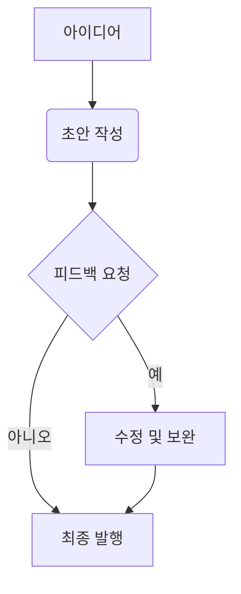

# Astro 블로그 성능 최적화 가이드: 이미지 및 마크다운 관리 팁

블로그의 성능은 사용자 경험과 검색 엔진 최적화(SEO)에 직접적인 영향을 미칩니다. Astro는 뛰어난 성능을 자랑하지만, 이미지를 적절히 최적화하고 마크다운 콘텐츠를 효율적으로 관리하면 그 잠재력을 더욱 극대화할 수 있습니다. 이 글에서는 Astro 블로그의 성능을 한 단계 끌어올릴 수 있는 실용적인 팁들을 공유합니다.

## 1. 이미지 최적화: 웹사이트 속도의 핵심

블로그에서 이미지는 시각적인 매력을 더해주지만, 최적화되지 않은 이미지는 페이지 로딩 속도를 현저히 저하시키는 주범이 됩니다.

### 가. 적절한 이미지 포맷 선택

- **JPEG**: 사진과 같이 색상 변화가 많은 이미지에 적합합니다. 웹용으로 압축률을 조절하여 파일 크기를 줄일 수 있습니다.
- **PNG**: 투명 배경이 필요한 로고나 아이콘, 선명한 그래픽에 적합합니다. 다만 파일 크기가 JPEG보다 클 수 있습니다.
- **WebP**: 구글에서 개발한 차세대 이미지 포맷으로, JPEG나 PNG보다 더 작은 파일 크기로 고품질 이미지를 제공합니다. 최신 브라우저 대부분이 지원하므로 적극적으로 활용하는 것을 권장합니다.
- **SVG**: 로고, 아이콘 등 벡터 그래픽에 사용합니다. 해상도에 구애받지 않고 선명하게 표시되며, 파일 크기가 매우 작습니다.

### 나. 이미지 크기 조절 및 반응형 이미지

- **적절한 크기**: 이미지를 너무 크게 업로드하지 마세요. 블로그에서 보여질 실제 크기에 맞춰 이미지를 미리 조절하는 것이 좋습니다.
- **반응형 이미지**: ``과 `<picture>` 요소를 사용하여 다양한 화면 크기에 최적화된 이미지를 제공하세요. Astro는 `<Image />` 컴포넌트(Astro v3.0 이상)를 통해 반응형 이미지와 지연 로딩을 쉽게 구현할 수 있도록 돕습니다.

```astro
// src/components/MyImage.astro (예시)
---
import { Image } from 'astro:assets';
import myImage from '../assets/my-image.jpg'; // 이미지를 import 합니다.
---
<Image src={myImage} alt="이미지 설명" width={800} heights={450} format="webp" />
```

### 다. 지연 로딩 (Lazy Loading)

- 사용자가 스크롤하여 해당 이미지가 화면에 보일 때까지 로딩을 지연시키는 기법입니다. `loading="lazy"` 속성을 `` 태그에 추가하여 간단히 적용할 수 있습니다.

```html

```

## 2. 마크다운 콘텐츠 관리: 가독성과 효율성

블로그 콘텐츠의 대부분은 마크다운으로 작성됩니다. 마크다운 파일을 효율적으로 관리하면 로딩 속도뿐만 아니라 작성 및 유지보수에도 도움이 됩니다.

### 가. 이미지 경로 관리

- 마크다운 파일 내에서 이미지 경로를 상대 경로 대신 `public/` 디렉토리를 기준으로 한 절대 경로(`'/images/blogs/my-image.jpg'`)로 사용하는 것이 좋습니다. 이는 Astro의 이미지 처리 방식과 일관성을 유지하고, 빌드 시 발생할 수 있는 경로 오류를 줄여줍니다.
- 이미지 파일명에 한글이나 특수문자를 사용하기보다는 영어와 숫자, 하이픈(`-`)만을 사용하는 것이 좋습니다.

### 나. 코드 블록 최적화

- 블로그 글에 코드 블록이 많다면, 구문 강조(Syntax Highlighting) 라이브러리가 과도하게 번들링되지 않도록 Astro의 빌트인 구문 강조 기능을 활용하거나, 필요한 언어만 선택적으로 로드하도록 설정하는 것이 좋습니다.

### 다. Mermaid 다이어그램 활용

- `BlogPost.astro`에서 설정했듯이, Mermaid 다이어그램을 사용하면 복잡한 개념을 시각적으로 명확하게 전달할 수 있습니다. 텍스트로만 설명하기 어려운 시스템 아키텍처나 흐름도를 다이어그램으로 표현해보세요. 이는 사용자 참여도를 높이고 콘텐츠의 가치를 더합니다.

````markdown

````

## 마무리하며

Astro는 기본적으로 빠른 성능을 제공하지만, 여기에 이미지 최적화 및 마크다운 콘텐츠 관리와 같은 추가적인 노력을 기울인다면 당신의 블로그는 방문자에게 훨씬 더 쾌적하고 만족스러운 경험을 선사할 것입니다. 꾸준한 최적화는 블로그의 성장에 필수적인 요소이니, 이 팁들을 활용하여 당신의 블로그를 더욱 강력하게 만들어보세요!

#Astro #성능최적화 #웹개발 #블로그팁 #개발
