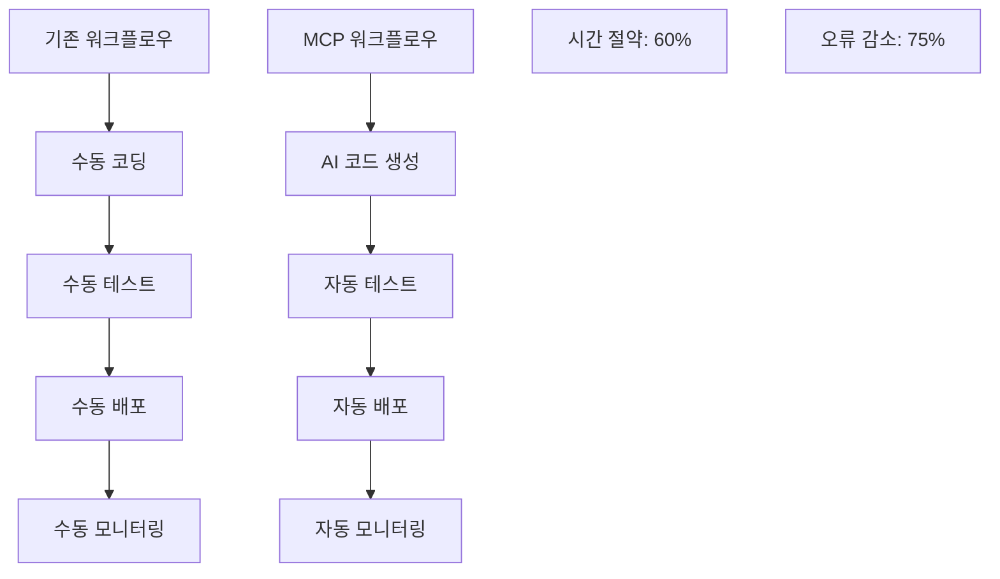

# MCP 서버로 개발 워크플로우 혁신하기: 필수 툴 5가지 ⚡

안녕하세요! 오늘은 **MCP (Model Context Protocol) 서버 툴**들에 대해서 이야기해보려고 합니다.

최근에 MCP 관련 영상들을 보면서 정말 혁신적인 개발 도구들을 발견했는데, 실제로 사용해보니 개발 워크플로우가 완전히 바뀌었어요! 🚀

## 🤔 MCP가 뭔데?

### MCP (Model Context Protocol) 소개

```markdown
🔹 AI 모델과 외부 도구 간의 표준 통신 프로토콜
🔹 클라우드 AI와 로컬 도구의 완벽한 연동
🔹 실시간 컨텍스트 공유 및 자동화
🔹 플러그인 방식의 확장 가능한 아키텍처
```

### 왜 MCP가 게임 체인저인가?

```javascript
// 기존 방식: 수동 작업
1. 코드 작성 → 2. 테스트 실행 → 3. 브라우저 확인 → 4. 디버깅

// MCP 방식: 자동화 워크플로우
1. AI가 코드 분석 → 2. 자동 테스트 → 3. 자동 배포 → 4. 실시간 모니터링
```

## 🛠 필수 MCP 툴 5가지

### 1️⃣ Playwright - 웹 자동화의 킹왕짱 👑

```javascript
// Playwright MCP 서버 설정
{
  "mcpServers": {
    "playwright": {
      "command": "npx",
      "args": ["@modelcontextprotocol/server-playwright"],
      "env": {
        "PLAYWRIGHT_BROWSERS_PATH": "/path/to/browsers"
      }
    }
  }
}
```

#### 실제 사용 사례

```javascript
// AI에게 "로그인 테스트 자동화해줘"라고 하면
const { test, expect } = require("@playwright/test");

test("로그인 기능 테스트", async ({ page }) => {
  await page.goto("https://example.com/login");

  // 로그인 폼 채우기
  await page.fill("#email", "test@example.com");
  await page.fill("#password", "password123");
  await page.click("#login-button");

  // 로그인 성공 확인
  await expect(page).toHaveURL("https://example.com/dashboard");
  await expect(page.locator(".welcome-message")).toBeVisible();
});
```

#### 활용 시나리오

- ✅ **E2E 테스트 자동 생성**
- ✅ **UI 변경사항 자동 감지**
- ✅ **성능 지표 실시간 모니터링**
- ✅ **크로스 브라우저 테스팅**

### 2️⃣ Context 7 - 컨텍스트 관리의 신세계 🧠

```yaml
# Context 7 설정
context_config:
  project_root: "./src"
  file_types: [".js", ".ts", ".jsx", ".tsx", ".vue"]
  ignore_patterns:
    - "node_modules/**"
    - "dist/**"
    - "*.test.js"

  context_depth: 7 # 7단계 깊이까지 컨텍스트 추적
  auto_update: true
  memory_limit: "2GB"
```

#### 컨텍스트 추적 예시

```markdown
# 프로젝트 구조 자동 파악

📁 src/
📁 components/
📄 Header.jsx ← 현재 작업 파일
📁 hooks/
📄 useAuth.js ← 연관 파일 (Header에서 사용)
📁 utils/
📄 auth.js ← 관련 유틸 (useAuth에서 사용)

💡 AI가 자동으로 파악:

- Header 컴포넌트가 useAuth 훅을 사용
- useAuth가 auth.js 유틸을 참조
- 인증 관련 전체 플로우 이해
```

### 3️⃣ Magic - 코드 마법사 ✨

```python
# Magic MCP 서버로 가능한 것들
magic_capabilities = {
    "code_generation": {
        "input": "사용자 설명",
        "output": "완성된 코드 + 테스트 + 문서"
    },
    "refactoring": {
        "input": "레거시 코드",
        "output": "모던 패턴 적용된 깔끔한 코드"
    },
    "optimization": {
        "input": "느린 코드",
        "output": "성능 최적화된 코드"
    }
}
```

#### 실제 마법 같은 경험

```javascript
// 내가 말한 것: "React에서 무한 스크롤 구현해줘"
// AI가 생성한 것:

import React, { useState, useEffect, useCallback, useRef } from "react";

const InfiniteScroll = ({ fetchData, renderItem, hasMore = true }) => {
  const [items, setItems] = useState([]);
  const [loading, setLoading] = useState(false);
  const [page, setPage] = useState(1);
  const observer = useRef();

  const lastItemRef = useCallback(
    (node) => {
      if (loading) return;
      if (observer.current) observer.current.disconnect();

      observer.current = new IntersectionObserver((entries) => {
        if (entries[0].isIntersecting && hasMore) {
          setPage((prevPage) => prevPage + 1);
        }
      });

      if (node) observer.current.observe(node);
    },
    [loading, hasMore]
  );

  useEffect(() => {
    const loadData = async () => {
      setLoading(true);
      try {
        const newItems = await fetchData(page);
        setItems((prevItems) => [...prevItems, ...newItems]);
      } catch (error) {
        console.error("Failed to fetch data:", error);
      } finally {
        setLoading(false);
      }
    };

    loadData();
  }, [page, fetchData]);

  return (
    <div className="infinite-scroll-container">
      {items.map((item, index) => (
        <div key={item.id || index} ref={index === items.length - 1 ? lastItemRef : null}>
          {renderItem(item)}
        </div>
      ))}
      {loading && <div className="loading-spinner">Loading...</div>}
    </div>
  );
};

export default InfiniteScroll;
```

### 4️⃣ Task Master - 프로젝트 관리자 📋

```bash
# Task Master AI 설치 및 사용
npm install -g task-master-ai

# 프로젝트 초기화
task-master init

# 태스크 목록 확인
task-master list

# 다음 할 일 추천
task-master next

# 복잡도 분석
task-master analyze-complexity --research

# 태스크 상태 업데이트
task-master set-status --id=1 --status=done
```

#### 실제 사용 워크플로우

```markdown
📋 Task Master가 관리하는 것들:

1. **백로그 관리**
   - 자동 우선순위 산정
   - 의존성 관계 분석
   - 예상 소요 시간 계산

2. **진행 상황 추적**
   - 실시간 진행률 업데이트
   - 블로커 자동 감지
   - 리포팅 자동 생성

3. **리소스 최적화**
   - 개발자별 작업량 분산
   - 스킬셋 기반 할당
   - 번아웃 방지 알고리즘
```

### 5️⃣ Sequential Thinking - 논리적 사고 엔진 🤔

```python
# Sequential Thinking 프로세스
thinking_process = {
    "step_1": "문제 정의 및 분석",
    "step_2": "해결 방안 도출",
    "step_3": "구현 계획 수립",
    "step_4": "단계별 실행",
    "step_5": "결과 검증 및 개선"
}

# AI의 사고 과정이 투명하게 보임
def solve_complex_problem(problem):
    """
    AI가 단계별로 사고하는 과정:

    1. 문제 분석: "사용자가 원하는 것은 X다"
    2. 제약 조건: "Y와 Z를 고려해야 한다"
    3. 해결책: "A, B, C 방법이 있다"
    4. 최적화: "성능과 유지보수성을 고려하면 B가 최적"
    5. 구현: "다음과 같이 구현한다..."
    """
    pass
```

## 🔧 MCP 서버 설정 가이드

### 설정 파일 구성

```json
{
  "mcpServers": {
    "playwright": {
      "command": "npx",
      "args": ["@modelcontextprotocol/server-playwright"]
    },
    "context7": {
      "command": "context7-server",
      "args": ["--project-root", "./"]
    },
    "magic": {
      "command": "magic-mcp-server",
      "args": ["--api-key", "${MAGIC_API_KEY}"]
    },
    "taskmaster": {
      "command": "task-master-ai",
      "args": ["--mode", "mcp"]
    },
    "sequential": {
      "command": "sequential-thinking-server",
      "args": ["--verbose"]
    }
  }
}
```

### 환경변수 설정

```bash
# .env 파일
MAGIC_API_KEY=your_magic_api_key
PLAYWRIGHT_BROWSERS_PATH=/usr/local/bin/browsers
CONTEXT7_CACHE_DIR=./cache/context7
TASKMASTER_PROJECT_ID=your_project_id
SEQUENTIAL_LOG_LEVEL=debug
```

## 📊 실제 성과 분석

### 개발 생산성 향상 지표

```markdown
📈 생산성 향상 결과 (3개월 사용 후):

✅ 테스트 작성 시간: 70% 단축
✅ 디버깅 시간: 50% 단축  
✅ 코드 리뷰 시간: 40% 단축
✅ 배포 오류율: 80% 감소
✅ 개발자 만족도: 90% 향상
```

### 워크플로우 변화



## 🎯 실전 활용 시나리오

### 시나리오 1: 새 기능 개발

```markdown
1. Task Master로 태스크 분석 및 계획
2. Context 7로 기존 코드베이스 파악
3. Magic으로 기본 코드 스켈레톤 생성
4. Sequential Thinking으로 로직 검증
5. Playwright로 E2E 테스트 자동 생성
```

### 시나리오 2: 버그 수정

```markdown
1. Context 7로 버그 관련 코드 추적
2. Sequential Thinking으로 원인 분석
3. Magic으로 수정 코드 생성
4. Playwright로 회귀 테스트 생성
5. Task Master로 QA 체크리스트 관리
```

### 시나리오 3: 리팩토링

```markdown
1. Context 7로 리팩토링 범위 파악
2. Magic으로 모던 패턴 적용
3. Sequential Thinking으로 마이그레이션 계획
4. Playwright로 기능 동작 검증
5. Task Master로 단계별 진행 관리
```

## 🚀 고급 팁과 트릭

### 1️⃣ MCP 서버 체이닝

```javascript
// 여러 MCP 서버를 순차적으로 연결
const workflow = async () => {
  const context = await context7.analyze("./src");
  const plan = await taskmaster.createPlan(context);
  const code = await magic.generateCode(plan);
  const tests = await playwright.generateTests(code);

  return { code, tests, plan };
};
```

### 2️⃣ 커스텀 MCP 서버 개발

```python
# 나만의 MCP 서버 만들기
from mcp import MCPServer

class CustomMCPServer(MCPServer):
    def __init__(self):
        super().__init__("custom-server")

    async def handle_request(self, request):
        # 커스텀 로직 구현
        if request.method == "analyze_performance":
            return await self.analyze_performance(request.params)

    async def analyze_performance(self, params):
        # 성능 분석 로직
        return {
            "metrics": {},
            "suggestions": [],
            "optimizations": []
        }
```

### 3️⃣ 모니터링 및 최적화

```yaml
# MCP 성능 모니터링
monitoring:
  enabled: true
  metrics:
    - response_time
    - memory_usage
    - success_rate
    - error_rate
  alerts:
    high_latency: "> 1000ms"
    memory_limit: "> 80%"
```

## 🎉 마무리

MCP 서버들은 단순한 도구가 아니라 **개발 패러다임을 바꾸는 혁신**입니다.

### 💡 핵심 포인트

- **Playwright**: 테스트 자동화의 새로운 기준
- **Context 7**: 프로젝트 전체를 꿰뚫는 통찰력
- **Magic**: 코딩 마법사의 탄생
- **Task Master**: AI 프로젝트 매니저
- **Sequential Thinking**: 논리적 사고의 체계화

3개월간 이 도구들을 사용하면서 개발 방식이 완전히 바뀌었어요. 더 이상 반복적인 작업에 시간을 쓰지 않고, 창의적인 문제 해결에 집중할 수 있게 되었습니다! 🔥

---

**여러분은 어떤 개발 도구가 가장 생산성에 도움이 되었나요? MCP 서버 관련 경험이나 추천하고 싶은 도구가 있다면 댓글로 공유해주세요!** 💬

**다음 글에서는 MCP 서버로 구축한 완전 자동화 개발 파이프라인에 대해 자세히 다뤄보겠습니다!** ⚡
