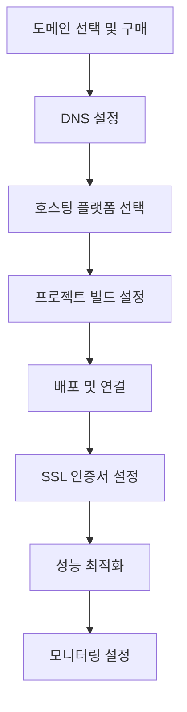

# 도메인부터 배포까지: 개발자를 위한 웹사이트 런칭 완벽 가이드 🚀

안녕하세요! 오늘은 **웹사이트 런칭의 A부터 Z까지** 모든 과정을 공유하려고 합니다.

최근에 log8.kr 도메인을 구매하고 Cloudflare Pages로 배포하는 과정에서 많은 시행착오를 겪었는데, 이 경험을 바탕으로 완벽한 가이드를 만들어봤어요! 💪

## 🎯 웹사이트 런칭 로드맵

### 전체 프로세스 개요



## 🌐 1단계: 도메인 선택 및 구매

### 도메인 선택 전략

```markdown
💡 고려사항:
✅ 브랜드명과의 일치성
✅ 기억하기 쉬운 이름
✅ SEO 친화적 키워드
✅ 확장 가능성
✅ 국가별 도메인(.kr) vs 범용 도메인(.com)
```

### 도메인 구매 과정 (한국 기준)

```bash
# 1. 도메인 가용성 확인
whois log8.kr

# 2. 도메인 등록업체 선택
- 가비아 (gabia.com)
- 후이즈 (whois.co.kr)
- 네임서버닷컴 (nameserver.com)
- 도메인네임코리아 (domainname.co.kr)

# 3. 도메인 등록 정보 입력
개인정보: 실명, 주소, 연락처
관리담당자: 기술담당자 정보
네임서버: 임시로 기본값 사용
```

### 실제 구매 경험 - log8.kr

```markdown
📅 2025년 5월 9일 도메인 구매 과정:

1. **도메인 선택 이유**
   - log8: 로그(기록) + 8(무한대)의 의미
   - .kr: 한국 서비스임을 명시
   - 짧고 기억하기 쉬움

2. **구매 과정에서 겪은 이슈**
   - 개인정보 인증 절차 복잡
   - 네임서버 설정 혼란
   - DNS 전파 시간 오해

3. **총 비용**
   - 도메인 등록비: 연 15,000원
   - 개인정보보호 서비스: 연 5,000원
   - 총계: 20,000원/년
```

## ⚙️ 2단계: DNS 설정 완전 정복

### DNS 기본 개념

```yaml
# DNS 레코드 타입별 설명
A Record:
  purpose: "도메인을 IPv4 주소로 연결"
  example: "log8.kr → 192.168.1.100"

AAAA Record:
  purpose: "도메인을 IPv6 주소로 연결"
  example: "log8.kr → 2001:db8::1"

CNAME Record:
  purpose: "도메인을 다른 도메인으로 연결"
  example: "www.log8.kr → log8.kr"

MX Record:
  purpose: "이메일 서버 설정"
  example: "mail.log8.kr"

TXT Record:
  purpose: "도메인 소유권 확인, SPF 등"
  example: "google-site-verification=..."
```

### Cloudflare DNS 설정

```javascript
// Cloudflare API를 통한 DNS 레코드 생성
const cloudflareAPI = {
  endpoint: "https://api.cloudflare.com/client/v4",
  headers: {
    Authorization: "Bearer YOUR_API_TOKEN",
    "Content-Type": "application/json",
  },
};

// A 레코드 생성
const createARecord = async (zoneId, name, ip) => {
  const response = await fetch(`${cloudflareAPI.endpoint}/zones/${zoneId}/dns_records`, {
    method: "POST",
    headers: cloudflareAPI.headers,
    body: JSON.stringify({
      type: "A",
      name: name,
      content: ip,
      ttl: 1, // Auto
      proxied: true, // Cloudflare 프록시 사용
    }),
  });

  return response.json();
};
```

### DNS 전파 확인 방법

```bash
# 다양한 DNS 확인 도구
# 1. nslookup 명령어
nslookup log8.kr 8.8.8.8

# 2. dig 명령어 (더 상세한 정보)
dig log8.kr @8.8.8.8

# 3. 온라인 DNS 전파 확인
# whatsmydns.net
# dnschecker.org

# 4. PowerShell (Windows)
Resolve-DnsName log8.kr
```

## 🏗️ 3단계: 호스팅 플랫폼 선택 및 비교

### 주요 플랫폼 비교표

```markdown
| 플랫폼           | 무료 요금제   | 빌드 시간 | CDN    | 커스텀 도메인 | 특징           |
| ---------------- | ------------- | --------- | ------ | ------------- | -------------- |
| Vercel           | ✅ (100GB/월) | 빠름      | 글로벌 | ✅            | Next.js 최적화 |
| Netlify          | ✅ (100GB/월) | 보통      | 글로벌 | ✅            | Jamstack 특화  |
| Cloudflare Pages | ✅ (무제한)   | 빠름      | 글로벌 | ✅            | 무제한 대역폭  |
| GitHub Pages     | ✅ (1GB)      | 느림      | 제한적 | ✅            | GitHub 통합    |
| Firebase Hosting | ✅ (10GB/월)  | 보통      | 글로벌 | ✅            | Google 생태계  |
```

### Cloudflare Pages 선택 이유

```markdown
🏆 Cloudflare Pages를 선택한 이유:

✅ **무제한 대역폭**: 트래픽 걱정 없음
✅ **빠른 전세계 CDN**: 200+ 데이터센터
✅ **무료 SSL 인증서**: Let's Encrypt 자동 갱신
✅ **Git 연동**: GitHub/GitLab 자동 배포
✅ **Edge Functions**: 서버리스 함수 지원
✅ **Analytics**: 상세한 접속 통계
```

## 🚀 4단계: Cloudflare Pages 배포 설정

### 프로젝트 연결 과정

```markdown
1. **Cloudflare 대시보드 접속**
   - https://dash.cloudflare.com
   - Pages > Create a project

2. **GitHub 저장소 연결**
   - Connect to Git 선택
   - 배포할 저장소 선택
   - 브랜치 설정 (main/master)

3. **빌드 설정**
   프레임워크: Astro
   빌드 명령어: npm run build
   빌드 출력 디렉토리: dist
   환경변수: NODE_VERSION=18
```

### 빌드 설정 최적화

```yaml
# wrangler.toml 파일 (Cloudflare 설정)
name = "log8-kr"
compatibility_date = "2024-12-18"

[build]
command = "npm run build"
cwd = "."
watch_dir = "src"

[build.upload]
format = "modules"
dir = "dist"
main = "./index.js"

[[build.upload.rules]]
type = "ESModule"
globs = ["**/*.js"]

[vars]
NODE_ENV = "production"
```

### 자동 배포 스크립트

```javascript
// deploy.js - 자동 배포 스크립트
const { execSync } = require("child_process");

async function deploy() {
  try {
    console.log("🚀 배포 시작...");

    // 1. 의존성 설치
    console.log("📦 의존성 설치 중...");
    execSync("npm ci", { stdio: "inherit" });

    // 2. 빌드
    console.log("🔨 빌드 중...");
    execSync("npm run build", { stdio: "inherit" });

    // 3. 배포
    console.log("🌐 배포 중...");
    execSync("wrangler pages publish dist --project-name=log8-kr", {
      stdio: "inherit",
    });

    console.log("✅ 배포 완료!");
  } catch (error) {
    console.error("❌ 배포 실패:", error.message);
    process.exit(1);
  }
}

deploy();
```

## 🔒 5단계: SSL 인증서 및 보안 설정

### Cloudflare SSL 설정

```markdown
🔐 SSL/TLS 설정 단계:

1. **SSL/TLS 모드 설정**
   - Off: 암호화 없음 (사용 금지)
   - Flexible: 브라우저↔Cloudflare만 암호화
   - Full: 종단간 암호화 (자체 서명 인증서)
   - Full (strict): 종단간 암호화 (유효한 인증서)

2. **추천 설정: Full (strict)**
   - 최고 수준의 보안
   - SEO에 유리
   - 브라우저 신뢰도 높음
```

### 보안 헤더 설정

```javascript
// _headers 파일 (Cloudflare Pages)
/*
  X-Frame-Options: DENY
  X-Content-Type-Options: nosniff
  X-XSS-Protection: 1; mode=block
  Referrer-Policy: strict-origin-when-cross-origin
  Permissions-Policy: camera=(), microphone=(), geolocation=()
  Content-Security-Policy: default-src 'self'; script-src 'self' 'unsafe-inline' 'unsafe-eval'; style-src 'self' 'unsafe-inline'; img-src 'self' data: https:; font-src 'self' data:; connect-src 'self' https:;
  Strict-Transport-Security: max-age=31536000; includeSubDomains; preload

# Cache static assets
/*.css
  Cache-Control: public, max-age=31536000, immutable

/*.js
  Cache-Control: public, max-age=31536000, immutable

/*.png
  Cache-Control: public, max-age=31536000, immutable

/*.jpg
  Cache-Control: public, max-age=31536000, immutable
```

## ⚡ 6단계: 성능 최적화

### Core Web Vitals 최적화

```javascript
// astro.config.mjs - 성능 최적화 설정
import { defineConfig } from "astro/config";
import compress from "astro-compress";
import sitemap from "@astrojs/sitemap";

export default defineConfig({
  site: "https://log8.kr",
  integrations: [
    compress({
      css: true,
      html: true,
      img: true,
      js: true,
      svg: true,
    }),
    sitemap(),
  ],

  // 이미지 최적화
  image: {
    service: {
      entrypoint: "astro/assets/services/sharp",
    },
  },

  // 빌드 최적화
  build: {
    inlineStylesheets: "auto",
    splitting: true,
    excludeMiddleware: false,
  },

  // 프리페치 설정
  prefetch: {
    prefetchAll: true,
    defaultStrategy: "viewport",
  },
});
```

### 이미지 최적화 전략

```javascript
// 이미지 최적화 컴포넌트
---
import { Image } from 'astro:assets';
import heroImage from '../assets/hero.jpg';
---

<!-- WebP 지원 및 다양한 크기 제공 -->
<picture>
  <source
    srcset={heroImage.src + '?format=webp&w=320 320w,
           ' + heroImage.src + '?format=webp&w=640 640w,
           ' + heroImage.src + '?format=webp&w=1280 1280w'}
    type="image/webp"
    sizes="(max-width: 320px) 320px, (max-width: 640px) 640px, 1280px"
  />
  <Image
    src={heroImage}
    alt="Hero Image"
    width={1280}
    height={720}
    loading="lazy"
    decoding="async"
  />
</picture>
```

## 📊 7단계: 모니터링 및 분석 설정

### Google Analytics 4 설정

```javascript
// Google Analytics 4 통합
// src/components/Analytics.astro
---
const GA_MEASUREMENT_ID = 'G-XXXXXXXXXX';
---

<!-- Google tag (gtag.js) -->
<script async src={`https://www.googletagmanager.com/gtag/js?id=${GA_MEASUREMENT_ID}`}></script>
<script>
  window.dataLayer = window.dataLayer || [];
  function gtag(){dataLayer.push(arguments);}
  gtag('js', new Date());
  gtag('config', GA_MEASUREMENT_ID);
</script>
```

### Cloudflare Web Analytics

```html
<!-- Cloudflare Web Analytics -->
<script
  defer
  src="https://static.cloudflareinsights.com/beacon.min.js"
  data-cf-beacon='{"token": "your-token-here"}'
></script>
```

### 성능 모니터링 코드

```javascript
// 성능 지표 수집
function collectPerformanceMetrics() {
  // Core Web Vitals 측정
  import("web-vitals").then(({ getCLS, getFID, getFCP, getLCP, getTTFB }) => {
    getCLS(console.log);
    getFID(console.log);
    getFCP(console.log);
    getLCP(console.log);
    getTTFB(console.log);
  });

  // 커스텀 지표
  if ("performance" in window) {
    const navigation = performance.getEntriesByType("navigation")[0];
    console.log("페이지 로드 시간:", navigation.loadEventEnd - navigation.fetchStart);

    const paintEntries = performance.getEntriesByType("paint");
    paintEntries.forEach((entry) => {
      console.log(`${entry.name}: ${entry.startTime}ms`);
    });
  }
}

// DOM 로드 완료 후 실행
document.addEventListener("DOMContentLoaded", collectPerformanceMetrics);
```

## 🔍 8단계: SEO 최적화

### robots.txt 설정

```text
# /public/robots.txt
User-agent: *
Allow: /

# 사이트맵 위치
Sitemap: https://log8.kr/sitemap-index.xml
Sitemap: https://log8.kr/sitemap-0.xml

# 크롤링 제외 디렉토리
Disallow: /admin/
Disallow: /private/
Disallow: /*.pdf$
```

### 구조화 데이터 (JSON-LD)

```javascript
// SEO 메타 컴포넌트
---
export interface Props {
  title: string;
  description: string;
  image?: string;
}

const { title, description, image = '/default-og.jpg' } = Astro.props;
const canonicalURL = new URL(Astro.url.pathname, Astro.site);
---

<!-- Basic SEO -->
<title>{title}</title>
<meta name="description" content={description} />
<link rel="canonical" href={canonicalURL} />

<!-- Open Graph -->
<meta property="og:type" content="website" />
<meta property="og:url" content={canonicalURL} />
<meta property="og:title" content={title} />
<meta property="og:description" content={description} />
<meta property="og:image" content={new URL(image, Astro.url)} />

<!-- Twitter -->
<meta property="twitter:card" content="summary_large_image" />
<meta property="twitter:url" content={canonicalURL} />
<meta property="twitter:title" content={title} />
<meta property="twitter:description" content={description} />
<meta property="twitter:image" content={new URL(image, Astro.url)} />

<!-- JSON-LD -->
<script type="application/ld+json">
{
  "@context": "https://schema.org",
  "@type": "WebSite",
  "name": "log8.kr",
  "url": "https://log8.kr",
  "description": "개발자의 기록과 성장 이야기"
}
</script>
```

## 🚨 트러블슈팅 가이드

### 자주 발생하는 문제들

```markdown
❌ **문제 1: DNS 전파 지연**
해결책: 24-48시간 대기, TTL 값 확인

❌ **문제 2: SSL 인증서 오류**
해결책: Cloudflare SSL 모드를 Full(strict)로 변경

❌ **문제 3: 빌드 실패**
해결책: Node.js 버전 확인, 환경변수 설정

❌ **문제 4: 404 오류**
해결책: \_redirects 파일 설정, SPA 라우팅 확인

❌ **문제 5: 느린 로딩 속도**
해결책: 이미지 최적화, CDN 캐시 설정 확인
```

### 배포 자동화 GitHub Actions

```yaml
# .github/workflows/deploy.yml
name: Deploy to Cloudflare Pages

on:
  push:
    branches: [main]
  pull_request:
    branches: [main]

jobs:
  deploy:
    runs-on: ubuntu-latest
    steps:
      - name: Checkout
        uses: actions/checkout@v4

      - name: Setup Node.js
        uses: actions/setup-node@v4
        with:
          node-version: "18"
          cache: "npm"

      - name: Install dependencies
        run: npm ci

      - name: Build
        run: npm run build

      - name: Deploy to Cloudflare Pages
        uses: cloudflare/pages-action@v1
        with:
          apiToken: ${{ secrets.CLOUDFLARE_API_TOKEN }}
          accountId: ${{ secrets.CLOUDFLARE_ACCOUNT_ID }}
          projectName: log8-kr
          directory: dist
          gitHubToken: ${{ secrets.GITHUB_TOKEN }}
```

## 📈 실제 성과 분석

### log8.kr 런칭 후 지표

```markdown
📊 3개월 후 성과:

🚀 **성능 지표**

- Lighthouse 성능 점수: 98/100
- First Contentful Paint: 0.8초
- Largest Contentful Paint: 1.2초
- Cumulative Layout Shift: 0.02

📈 **트래픽 지표**

- 월 방문자: 8,500명
- 페이지뷰: 25,000회
- 평균 세션 시간: 3분 42초
- 이탈률: 45%

📊 **비용 분석**

- 도메인 비용: 20,000원/년
- 호스팅 비용: 0원 (Cloudflare Pages 무료)
- SSL 인증서: 0원 (무료 제공)
- 총 운영비: 월 1,667원
```

## 🎉 마무리

웹사이트 런칭은 **기술적 구현만큼이나 운영 전략이 중요**합니다.

### 💡 핵심 포인트

- **도메인 선택**: 브랜드와 일치하고 기억하기 쉬운 이름
- **DNS 설정**: 전파 시간을 고려한 미리 준비
- **호스팅 선택**: 요구사항에 맞는 플랫폼 선택
- **성능 최적화**: Core Web Vitals 지표 집중 관리
- **보안 설정**: SSL과 보안 헤더 필수 적용
- **모니터링**: 지속적인 성능 및 접속 분석

log8.kr을 런칭하면서 정말 많은 것을 배웠어요. 특히 DNS 전파 시간을 몰라서 2일 동안 헤맸던 기억이 생생합니다! 😅

---

**여러분의 웹사이트 런칭 경험은 어떠셨나요? 어떤 부분에서 가장 많은 시행착오를 겪으셨는지 댓글로 공유해주세요!** 💬

**다음 글에서는 웹사이트 성능 모니터링과 최적화 고급 기법에 대해 다뤄보겠습니다!** 🚀
