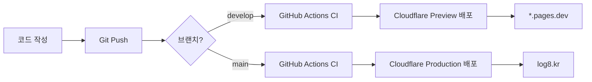

현대 웹 개발에서 CICD(지속적 통합/지속적 배포)는 선택이 아닌 필수입니다. 이 글에서는 **GitHub Actions**를 활용한 자동화된 품질 검사와 **Cloudflare Pages**를 통한 무료 배포 환경을 구축하는 방법을 실무 관점에서 상세히 다룹니다.

## 🎯 왜 GitHub Actions + Cloudflare Pages인가?

### GitHub Actions의 장점

- **무료 사용량**: Public 저장소는 무제한, Private 저장소도 월 2,000분 무료
- **간편한 설정**: YAML 파일 하나로 복잡한 워크플로우 구성
- **방대한 생태계**: 수천 개의 액션을 마켓플레이스에서 즉시 활용 가능

### Cloudflare Pages의 장점

- **완전 무료**: 무제한 대역폭과 요청
- **빠른 글로벌 CDN**: 전 세계 275+ 데이터 센터
- **자동 HTTPS**: SSL 인증서 자동 발급 및 갱신
- **Preview 배포**: PR마다 고유한 프리뷰 URL 자동 생성

## 🔄 전체 워크플로우 이해하기



**핵심 흐름**:

1. 개발자가 코드를 작성하고 Git에 푸시
2. GitHub Actions가 자동으로 코드 품질 검사 실행
3. CI 통과 시 Cloudflare Pages가 자동 배포
4. 브랜치에 따라 Production 또는 Preview 환경으로 배포

## 🤖 GitHub Actions 설정: 품질 검사 자동화

### CI 파이프라인 구성 요소

**`.github/workflows/ci.yml`** 파일을 통해 다음 작업들을 자동화합니다:

#### 1. 코드 품질 검사

```yaml
- name: Check code formatting
  run: pnpm run format:check

- name: Type check
  run: pnpm run type-check

- name: Build project
  run: pnpm run build
```

**목적**: Prettier를 통한 코드 스타일 일관성 유지, TypeScript 타입 오류 사전 감지, 빌드 실패 조기 발견

#### 2. 보안 감사

```yaml
- name: Security audit
  run: pnpm audit --audit-level moderate
```

**목적**: 의존성 패키지의 보안 취약점을 자동으로 스캔하여 프로덕션 배포 전 보안 이슈 해결

#### 3. 성능 모니터링

```yaml
- name: Lighthouse CI
  run: |
    npm install -g @lhci/cli
    lhci autorun
```

**목적**: Pull Request마다 Lighthouse 성능 점수를 측정하고, 성능 저하를 사전에 감지

### 자동 실행 트리거 설정

```yaml
on:
  push:
    branches: [main, develop]
  pull_request:
    branches: [main, develop]
```

**의미**: `main` 또는 `develop` 브랜치에 푸시하거나 PR을 생성할 때마다 자동으로 CI 파이프라인이 실행됩니다.

## ☁️ Cloudflare Pages 설정: 자동 배포 환경 구축

### 초기 설정 (최초 1회)

1. **Cloudflare Dashboard 접속**: https://dash.cloudflare.com
2. **Workers & Pages** → **Pages** 메뉴로 이동
3. **GitHub 연동**: "Connect to Git" 버튼 클릭
4. **저장소 선택**: 배포할 GitHub 저장소 선택
5. **빌드 설정 입력**:
   ```yaml
   Build command: pnpm run build
   Build output directory: dist
   Root directory: /
   Environment variables:
     NODE_VERSION: 20
     SITE_URL: https://log8.kr
   ```

### 브랜치별 배포 전략

| 브랜치         | 배포 타입      | URL                                | 용도                                   |
| -------------- | -------------- | ---------------------------------- | -------------------------------------- |
| `main`         | **Production** | https://log8.kr                    | 실제 사용자에게 노출되는 프로덕션 환경 |
| `develop`      | **Preview**    | https://develop.*.pages.dev        | 개발팀 내부 테스트 환경                |
| Feature 브랜치 | **PR Preview** | https://[commit-hash].\*.pages.dev | 기능별 독립 테스트 환경                |

**이점**: 각 브랜치가 독립된 환경을 가지므로, 프로덕션에 영향 없이 안전하게 테스트 가능

### 커스텀 도메인 연결

**Cloudflare Dashboard** → **Custom domains** 에서:

1. "Set up a custom domain" 클릭
2. 도메인 입력 (예: `log8.kr`)
3. DNS 레코드 자동 추가 확인
4. HTTPS 자동 활성화 확인

## 🚀 실전 배포 시나리오

### 시나리오 1: 새 기능 개발 및 배포

```bash
# 1. Feature 브랜치 생성
git checkout -b feat/user-authentication
git add .
git commit -m "feat: 사용자 인증 기능 추가"
git push origin feat/user-authentication

# 2. GitHub에서 PR 생성
# → GitHub Actions CI 자동 실행
# → Cloudflare Preview 배포 자동 생성
# → PR에 Preview URL 자동 코멘트

# 3. 팀원들과 Preview URL에서 기능 확인
# → https://feat-user-auth-abc123.*.pages.dev

# 4. 리뷰 완료 후 develop 브랜치로 머지
git checkout develop
git merge feat/user-authentication
git push origin develop

# 5. develop 환경에서 충분한 테스트 진행
# → https://develop.*.pages.dev

# 6. 문제없으면 main으로 머지하여 프로덕션 배포
git checkout main
git merge develop
git push origin main

# 7. 2-3분 후 프로덕션 사이트 업데이트 확인
# → https://log8.kr
```

### 시나리오 2: 긴급 버그 수정 (Hotfix)

```bash
# 1. main에서 직접 hotfix 브랜치 생성
git checkout -b hotfix/critical-security-fix main

# 2. 버그 수정 및 커밋
git add .
git commit -m "fix: 보안 취약점 긴급 패치"
git push origin hotfix/critical-security-fix

# 3. PR 생성 및 빠른 리뷰
# → CI 통과 확인

# 4. main으로 즉시 머지
git checkout main
git merge hotfix/critical-security-fix
git push origin main

# 5. develop에도 반영 (중요!)
git checkout develop
git merge hotfix/critical-security-fix
git push origin develop
```

## 📊 품질 모니터링 및 최적화

### GitHub Actions 실행 결과 확인

**GitHub 저장소** → **Actions** 탭에서:

- ✅ 모든 체크가 통과했는지 확인
- ❌ 실패 시 로그 확인 및 문제 해결
- 📈 실행 시간 추이 모니터링

### Cloudflare Analytics 활용

**Cloudflare Dashboard** → **Analytics** 탭에서:

- **Web Analytics**: 페이지 뷰, 방문자 수, 이탈률
- **Performance**: Core Web Vitals, 로딩 시간
- **Error Rate**: 4xx, 5xx 에러 발생 빈도

## 🔧 트러블슈팅 가이드

### 문제 1: CI에서 빌드 실패

**증상**: GitHub Actions에서 `pnpm run build` 실패

**해결책**:

```bash
# 로컬에서 빌드 재현
pnpm install
pnpm run build

# 타입 에러 확인
pnpm run type-check

# 의존성 문제 해결
rm -rf node_modules pnpm-lock.yaml
pnpm install
```

### 문제 2: Cloudflare 배포는 성공했지만 사이트가 작동하지 않음

**증상**: 배포는 성공했지만 페이지가 404 또는 빈 화면

**원인 및 해결책**:

1. **빌드 출력 디렉토리 확인**: `dist` 폴더가 맞는지 확인
2. **환경 변수 누락**: Cloudflare Dashboard에서 필요한 환경 변수 추가
3. **라우팅 문제**: SPA의 경우 `_redirects` 파일 추가:
   ```
   /*    /index.html   200
   ```

### 문제 3: 배포가 너무 오래 걸림

**최적화 방법**:

```yaml
# Cloudflare 빌드 캐시 활용
# package.json에 engines 명시
"engines": {
  "node": ">=20.0.0",
  "pnpm": ">=8.0.0"
}

# 의존성 캐싱
# .github/workflows/ci.yml
- uses: actions/setup-node@v4
  with:
    cache: 'pnpm'
```

## 🎯 모범 사례 체크리스트

### 코드 푸시 전

- [ ] `pnpm run format` 실행하여 코드 스타일 통일
- [ ] `pnpm run build` 성공 확인
- [ ] `pnpm run preview`로 로컬 테스트

### PR 생성 전

- [ ] GitHub Actions CI 통과 확인
- [ ] Cloudflare Preview URL에서 직접 테스트
- [ ] 변경 사항을 명확하게 PR 설명에 작성

### Production 배포 전

- [ ] develop 브랜치에서 충분히 테스트
- [ ] 코드 리뷰 완료
- [ ] 배포 후 모니터링 계획 수립

## 🌟 실무 팁

### 1. Commit Convention 도입

```bash
# Conventional Commits 스타일 사용
feat: 새로운 기능 추가
fix: 버그 수정
docs: 문서 수정
style: 코드 포맷팅
refactor: 코드 리팩토링
test: 테스트 추가
chore: 빌드 작업, 패키지 매니저 설정
```

### 2. 브랜치 보호 규칙 설정

**GitHub 저장소** → **Settings** → **Branches**:

- `main` 브랜치에 직접 푸시 금지
- PR 승인 필수
- CI 통과 필수

### 3. 자동 배포 알림 설정

**Slack 연동**:

```yaml
- name: Notify deployment
  uses: 8398a7/action-slack@v3
  with:
    status: ${{ job.status }}
    text: "🚀 Production 배포 완료!"
    webhook_url: ${{ secrets.SLACK_WEBHOOK }}
```

## 결론

GitHub Actions와 Cloudflare Pages를 조합하면 **무료**로 **엔터프라이즈급 CICD 파이프라인**을 구축할 수 있습니다. 이 가이드를 따라하면:

✅ 코드 품질 자동 검사
✅ 보안 취약점 조기 발견
✅ 브랜치별 독립 환경 테스트
✅ 프로덕션 자동 배포
✅ 글로벌 CDN을 통한 빠른 서비스

이 모든 것을 몇 시간 내에 설정할 수 있습니다. 지금 바로 시작해보세요!

## 참고 자료

- [GitHub Actions 공식 문서](https://docs.github.com/en/actions)
- [Cloudflare Pages 문서](https://developers.cloudflare.com/pages)
- [Lighthouse CI 가이드](https://github.com/GoogleChrome/lighthouse-ci)
