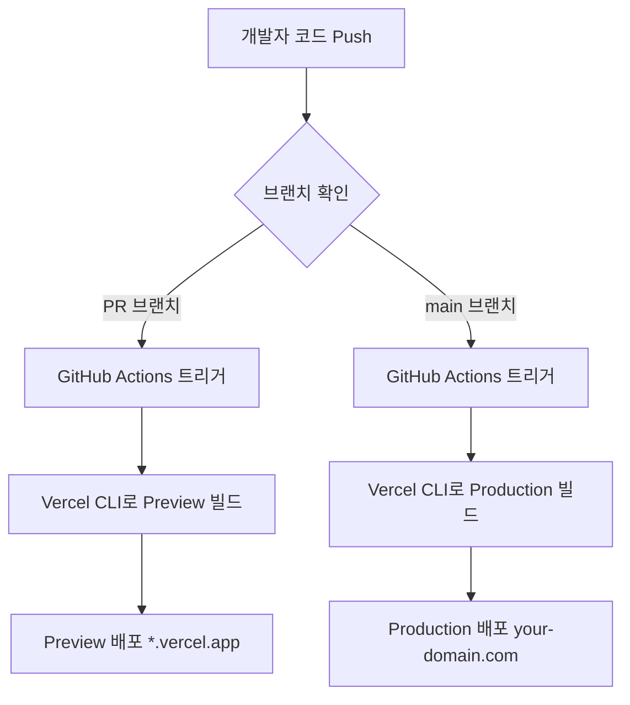

GitHub 조직(Organization) 저장소를 운영하다 보면 Vercel의 Git 연동을 사용하기 어려운 상황에 자주 직면합니다. 조직 정책, 권한 문제, 무료 플랜 제약 등 다양한 이유로 인해 일반적인 배포 방법이 막히는 경우가 많습니다.

이 글에서는 **Git 연동 없이 Vercel CLI + GitHub Actions + 3개의 시크릿(토큰/ID)**만으로 안전하고 자동화된 배포 파이프라인을 구축하는 방법을 실무 관점에서 상세히 설명합니다.

## 🚨 문제 상황: 왜 조직 저장소는 배포가 까다로운가?

### 전형적인 시나리오

```
Organization Repository → Vercel Git 연동 시도 → ❌ 실패

오류 메시지:
- "Organization repositories require a Team plan"
- "Insufficient permissions"
- "Git integration not available for this repository"
```

### 주요 장애물

1. **조직 저장소 제약**: Vercel 무료 플랜은 개인 저장소만 Git 연동 지원
2. **보안 정책**: 조직 관리자가 외부 앱 연동을 차단한 경우
3. **권한 문제**: 저장소에 대한 Vercel 앱 설치 권한이 없는 경우
4. **비용**: Team 플랜으로 업그레이드하기에는 부담

## 💡 해결책: Vercel CLI를 활용한 우회 배포

### 핵심 아이디어

**"Git 연동을 사용하지 않고, CI 환경에서 Vercel CLI로 직접 인증/빌드/배포"**

### 필요한 것

단 3개의 시크릿만 있으면 됩니다:

- `VERCEL_ORG_ID`: Vercel 팀 또는 개인 계정 ID
- `VERCEL_PROJECT_ID`: Vercel 프로젝트 ID
- `VERCEL_TOKEN`: Vercel API 토큰

### 이 방법의 장점

✅ **Git 연동 불필요**: 조직 정책에 구애받지 않음
✅ **무료 플랜 가능**: Team 플랜 없이도 완벽하게 작동
✅ **완전 자동화**: PR 생성 시 Preview, main 브랜치 배포 시 Production
✅ **권한 최소화**: 배포에 필요한 최소한의 권한만 사용
✅ **재현 가능**: 로컬/CI 어디서든 동일한 프로세스

## 📋 전체 흐름 한눈에 보기



**핵심 프로세스**:

1. Vercel에서 프로젝트 생성 (Git 연동 없이)
2. 프로젝트 ID와 조직 ID 확인
3. API 토큰 생성
4. GitHub Secrets에 3개 값 등록
5. GitHub Actions 워크플로우 설정
6. 자동 배포 완성!

## 🔧 1단계: Vercel 프로젝트 설정

### 1.1 프로젝트 생성

**Vercel Dashboard 접속**: https://vercel.com/dashboard

1. "Add New..." → "Project" 클릭
2. **Git 연동 건너뛰기**: "Import" 대신 "Continue with Template" 또는 빈 프로젝트 생성
3. 프레임워크 선택: Next.js, Astro, SvelteKit 등
4. 프로젝트 이름 설정

**중요**: Git 저장소를 연결하지 않고 프로젝트만 먼저 생성합니다.

### 1.2 프로젝트 ID 확인

```
Vercel Dashboard → 프로젝트 선택 → Settings → General → Project ID
```

**예시**: `prj_abc123xyz789`

이 값을 복사하여 메모장에 저장합니다.

### 1.3 조직/팀 ID 확인

```
Vercel Dashboard → Settings → General → Team ID (또는 User ID)
```

**형식**:

- 팀 계정: `team_abc123xyz789`
- 개인 계정: `user_abc123xyz789`

이 값도 복사하여 저장합니다.

### 1.4 API 토큰 생성

```
Vercel Dashboard → Settings → Tokens → Create Token
```

**주의사항**:

- 토큰은 생성 직후 한 번만 표시됩니다
- 즉시 복사하여 안전한 곳에 저장
- 토큰 이름: `github-actions-deploy` (알아보기 쉽게)
- 권한 범위: 기본 설정 (Full Account Access)

**생성된 토큰 예시**: `vercel_abc123...xyz789`

## 🔐 2단계: GitHub Secrets 등록

### GitHub 저장소 설정

```
GitHub 저장소 → Settings → Secrets and variables → Actions
→ "New repository secret" 클릭
```

### 3개의 시크릿 추가

**1. VERCEL_ORG_ID**

```
Name: VERCEL_ORG_ID
Value: team_abc123xyz789 (또는 user_abc123xyz789)
```

**2. VERCEL_PROJECT_ID**

```
Name: VERCEL_PROJECT_ID
Value: prj_abc123xyz789
```

**3. VERCEL_TOKEN**

```
Name: VERCEL_TOKEN
Value: vercel_abc123...xyz789
```

### 조직 저장소 권한 주의사항

- 저장소 관리 권한이 있어야 시크릿 등록 가능
- 권한이 없다면 조직 관리자에게 요청
- Organization-level secrets 사용도 가능 (여러 저장소에서 공유)

## ⚙️ 3단계: GitHub Actions 워크플로우 작성

### 파일 생성

`.github/workflows/vercel-deploy.yml` 파일을 생성합니다.

### 완전한 워크플로우 코드

```yaml
name: Vercel Deploy (CLI)

on:
  push:
    branches: [main]
  pull_request:
  workflow_dispatch: # 수동 실행 가능

env:
  VERCEL_ORG_ID: ${{ secrets.VERCEL_ORG_ID }}
  VERCEL_PROJECT_ID: ${{ secrets.VERCEL_PROJECT_ID }}
  VERCEL_TOKEN: ${{ secrets.VERCEL_TOKEN }}
  NEXT_TELEMETRY_DISABLED: 1 # Next.js 텔레메트리 비활성화

jobs:
  deploy-preview:
    name: Deploy Preview
    if: github.event_name == 'pull_request'
    runs-on: ubuntu-latest
    steps:
      - name: Checkout code
        uses: actions/checkout@v4

      - name: Setup Node.js
        uses: actions/setup-node@v4
        with:
          node-version: 20
          cache: "pnpm"

      - name: Setup pnpm
        uses: pnpm/action-setup@v4
        with:
          version: 9
          run_install: true

      - name: Pull Vercel environment (preview)
        run: pnpm dlx vercel@latest pull --yes --environment=preview --token "$VERCEL_TOKEN"

      - name: Build with Vercel
        run: pnpm dlx vercel@latest build --token "$VERCEL_TOKEN"

      - name: Deploy to Vercel (preview)
        run: |
          url=$(pnpm dlx vercel@latest deploy --prebuilt --token "$VERCEL_TOKEN" --yes)
          echo "Preview URL: $url"
          echo "PREVIEW_URL=$url" >> $GITHUB_ENV

      - name: Comment PR with preview URL
        uses: actions/github-script@v7
        if: github.event_name == 'pull_request'
        with:
          script: |
            github.rest.issues.createComment({
              issue_number: context.issue.number,
              owner: context.repo.owner,
              repo: context.repo.repo,
              body: `🚀 Preview deployed!\n\n✨ **Preview URL**: ${process.env.PREVIEW_URL}`
            })

  deploy-production:
    name: Deploy Production
    if: github.event_name == 'push' && github.ref == 'refs/heads/main'
    runs-on: ubuntu-latest
    steps:
      - name: Checkout code
        uses: actions/checkout@v4

      - name: Setup Node.js
        uses: actions/setup-node@v4
        with:
          node-version: 20
          cache: "pnpm"

      - name: Setup pnpm
        uses: pnpm/action-setup@v4
        with:
          version: 9
          run_install: true

      - name: Pull Vercel environment (production)
        run: pnpm dlx vercel@latest pull --yes --environment=production --token "$VERCEL_TOKEN"

      - name: Build with Vercel
        run: pnpm dlx vercel@latest build --token "$VERCEL_TOKEN"

      - name: Deploy to Vercel (production)
        run: pnpm dlx vercel@latest deploy --prebuilt --prod --token "$VERCEL_TOKEN" --yes

      - name: Deployment completed
        run: echo "✅ Production deployment completed successfully!"
```

### 주요 명령어 설명

#### `vercel pull`

```bash
pnpm dlx vercel@latest pull --yes --environment=preview --token "$VERCEL_TOKEN"
```

**역할**: Vercel에 저장된 환경변수를 CI 환경으로 동기화

**생성되는 파일**:

- `.vercel/project.json`: 프로젝트 메타데이터
- `.vercel/README.txt`: 설정 정보
- `.env.local`: 환경변수 (Preview 또는 Production)

#### `vercel build`

```bash
pnpm dlx vercel@latest build --token "$VERCEL_TOKEN"
```

**역할**: Vercel 빌드 시스템으로 프로젝트 빌드

**생성되는 디렉토리**:

- `.vercel/output`: 배포용 프리빌트 아티팩트

**장점**:

- Vercel의 최적화된 빌드 설정 사용
- 이미지 최적화, Edge Functions 등 자동 처리

#### `vercel deploy --prebuilt`

```bash
pnpm dlx vercel@latest deploy --prebuilt --prod --token "$VERCEL_TOKEN" --yes
```

**역할**: 이미 빌드된 아티팩트를 Vercel에 업로드

**옵션**:

- `--prebuilt`: `.vercel/output` 디렉토리 사용
- `--prod`: Production 도메인에 배포 (없으면 Preview)
- `--yes`: 확인 프롬프트 건너뛰기

## 🚀 4단계: 실전 배포 시나리오

### 시나리오 1: PR 생성 시 자동 Preview 배포

```bash
# 1. Feature 브랜치 생성
git checkout -b feat/user-authentication

# 2. 코드 작성 및 커밋
git add .
git commit -m "feat: 사용자 인증 기능 추가"

# 3. GitHub에 푸시
git push origin feat/user-authentication

# 4. GitHub에서 PR 생성
# → GitHub Actions 자동 실행
# → Vercel Preview 배포
# → PR 코멘트에 Preview URL 자동 추가
```

**결과**: 팀원들이 PR에서 Preview URL을 클릭하여 변경사항 즉시 확인 가능

### 시나리오 2: main 브랜치 병합 시 Production 배포

```bash
# 1. PR 리뷰 완료 후 main으로 병합
git checkout main
git merge feat/user-authentication

# 2. main 브랜치 푸시
git push origin main

# 3. GitHub Actions 자동 실행
# → Vercel Production 배포
# → 실제 도메인에 반영

# 4. 배포 확인
# → https://your-domain.com
```

**결과**: 2-3분 내에 프로덕션 사이트 업데이트 완료

## 🔧 5단계: 로컬에서 수동 배포 (선택사항)

긴급 배포가 필요하거나 CI를 거치지 않고 배포해야 할 때:

### 환경변수 설정

```bash
# Windows (PowerShell)
$env:VERCEL_ORG_ID="team_abc123xyz789"
$env:VERCEL_PROJECT_ID="prj_abc123xyz789"
$env:VERCEL_TOKEN="vercel_abc123...xyz789"

# macOS/Linux
export VERCEL_ORG_ID="team_abc123xyz789"
export VERCEL_PROJECT_ID="prj_abc123xyz789"
export VERCEL_TOKEN="vercel_abc123...xyz789"
```

### 배포 실행

```bash
# 1. 환경변수 동기화
pnpm dlx vercel pull --yes --environment=production

# 2. 빌드
pnpm dlx vercel build

# 3. 배포
pnpm dlx vercel deploy --prebuilt --prod
```

## 🛠️ 트러블슈팅 가이드

### 문제 1: 401 Unauthorized

**증상**:

```
Error: Invalid token
401 Unauthorized
```

**원인 및 해결책**:

1. **토큰 만료**: Vercel Dashboard에서 새 토큰 생성
2. **토큰 오타**: GitHub Secrets에서 값 재확인
3. **권한 부족**: 토큰을 생성한 계정이 프로젝트 접근 권한이 있는지 확인

### 문제 2: 403 Forbidden

**증상**:

```
Error: Forbidden
You don't have access to this project
```

**원인 및 해결책**:

1. **ORG_ID 불일치**: 프로젝트 소유 주체(팀/개인)와 `VERCEL_ORG_ID` 일치 확인
2. **PROJECT_ID 오류**: Vercel Dashboard에서 정확한 Project ID 재확인
3. **토큰 범위**: 토큰이 해당 팀/프로젝트에 대한 권한 포함 확인

### 문제 3: 404 Not Found

**증상**:

```
Error: Project not found
404 Not Found
```

**원인 및 해결책**:

1. **PROJECT_ID 오타**: 복사-붙여넣기로 정확히 입력
2. **프로젝트 삭제**: Vercel에서 프로젝트 존재 여부 확인
3. **대소문자 구분**: ID는 대소문자를 정확히 구분

### 문제 4: 빌드 실패

**증상**:

```
Error: Build failed
Exit code: 1
```

**원인 및 해결책**:

**Node 버전 불일치**:

```yaml
- uses: actions/setup-node@v4
  with:
    node-version: 20 # 로컬과 동일한 버전 사용
```

**의존성 설치 실패**:

```yaml
- uses: pnpm/action-setup@v4
  with:
    version: 9 # package.json의 packageManager 필드와 일치
    run_install: true
```

**환경변수 누락**:

```bash
# Vercel Dashboard에서 필요한 환경변수 설정
# Settings → Environment Variables
```

### 문제 5: Preview는 성공, Production 실패

**증상**: PR 배포는 되는데 main 브랜치 배포 실패

**원인 및 해결책**:

1. **Production 환경변수 누락**:

   ```bash
   # Vercel Dashboard → Settings → Environment Variables
   # Production 환경에 필요한 변수 추가
   ```

2. **--prod 권한 확인**:

   ```yaml
   # 토큰이 Production 배포 권한 포함 확인
   ```

3. **브랜치 보호 규칙**:
   ```
   # GitHub Settings → Branches
   # main 브랜치 보호 규칙이 CI를 차단하지 않는지 확인
   ```

## 💎 고급 활용 팁

### 팁 1: Monorepo 지원

프로젝트가 monorepo의 하위 디렉토리에 있는 경우:

```yaml
jobs:
  deploy-preview:
    runs-on: ubuntu-latest
    defaults:
      run:
        working-directory: apps/web # 하위 디렉토리 지정
    steps:
      # ... (이하 동일)
```

또는 Vercel 프로젝트 설정에서:

```
Settings → General → Root Directory → apps/web
```

### 팁 2: 환경변수 전략

**민감한 정보는 Vercel Dashboard에 저장**:

```
Settings → Environment Variables
- DATABASE_URL (Production)
- API_KEY (Production, Preview)
- NEXT_PUBLIC_APP_URL (Production, Preview)
```

**CI에서만 필요한 값은 GitHub Secrets에**:

```yaml
env:
  CI_SPECIFIC_VAR: ${{ secrets.CI_VAR }}
```

### 팁 3: 배포 알림 설정

**Slack 알림 추가**:

```yaml
- name: Notify Slack
  if: success()
  uses: slackapi/slack-github-action@v1
  with:
    payload: |
      {
        "text": "🚀 Production 배포 완료!",
        "url": "https://your-domain.com"
      }
  env:
    SLACK_WEBHOOK_URL: ${{ secrets.SLACK_WEBHOOK }}
```

### 팁 4: 캐시 최적화

빌드 속도 향상을 위한 캐시 설정:

```yaml
- uses: actions/setup-node@v4
  with:
    node-version: 20
    cache: "pnpm" # pnpm 의존성 캐싱

- uses: actions/cache@v4
  with:
    path: .vercel
    key: ${{ runner.os }}-vercel-${{ hashFiles('**/pnpm-lock.yaml') }}
```

### 팁 5: npm/yarn 사용자를 위한 설정

**npm 사용 시**:

```yaml
- uses: actions/setup-node@v4
  with:
    node-version: 20
    cache: "npm"
- run: npm ci
- run: npx vercel pull --yes --environment=preview --token "$VERCEL_TOKEN"
- run: npx vercel build --token "$VERCEL_TOKEN"
- run: npx vercel deploy --prebuilt --token "$VERCEL_TOKEN" --yes
```

**yarn 사용 시**:

```yaml
- uses: actions/setup-node@v4
  with:
    node-version: 20
    cache: "yarn"
- run: yarn --frozen-lockfile
- run: yarn dlx vercel pull --yes --environment=preview --token "$VERCEL_TOKEN"
- run: yarn dlx vercel build --token "$VERCEL_TOKEN"
- run: yarn dlx vercel deploy --prebuilt --token "$VERCEL_TOKEN" --yes
```

## 🔐 보안 모범 사례

### 1. 토큰 관리

✅ **해야 할 것**:

- GitHub Secrets에만 저장
- 정기적으로 토큰 재생성 (3-6개월)
- 최소 권한 원칙 적용

❌ **하지 말아야 할 것**:

- 코드에 하드코딩
- 공개 저장소의 환경 파일에 포함
- 팀원과 토큰 직접 공유

### 2. 권한 분리

```
개발자 → GitHub Push 권한만
CI → Vercel 배포 권한만
관리자 → Secrets 관리 권한
```

### 3. 감사 로그 활용

```
Vercel Dashboard → Settings → Audit Log
- 배포 이력 확인
- 토큰 사용 내역 모니터링
- 이상 활동 감지
```

## 📊 Git 연동 vs CLI 배포 비교

| 항목               | Git 연동          | CLI 배포 (본 가이드) |
| ------------------ | ----------------- | -------------------- |
| **설정 난이도**    | ⭐⭐ 쉬움         | ⭐⭐⭐ 중간          |
| **조직 저장소**    | ❌ Team 플랜 필요 | ✅ 무료 플랜 가능    |
| **권한 문제**      | ❌ 자주 발생      | ✅ 최소 권한         |
| **커스터마이징**   | ⭐⭐ 제한적       | ⭐⭐⭐⭐⭐ 완전 제어 |
| **빌드 캐시**      | ✅ 자동           | ⭐⭐⭐ 수동 설정     |
| **Preview 코멘트** | ✅ 자동           | ⭐⭐⭐ 스크립트 필요 |
| **보안성**         | ⭐⭐⭐ 양호       | ⭐⭐⭐⭐⭐ 우수      |
| **유지보수**       | ⭐⭐⭐⭐⭐ 쉬움   | ⭐⭐⭐ 중간          |

## ✅ 최종 체크리스트

배포 전 반드시 확인:

### Vercel 설정

- [ ] 프로젝트 생성 완료
- [ ] `VERCEL_PROJECT_ID` 정확히 복사
- [ ] `VERCEL_ORG_ID` 정확히 복사 (`team_*` 또는 `user_*`)
- [ ] `VERCEL_TOKEN` 생성 및 저장
- [ ] 필요한 환경변수 Vercel Dashboard에 등록

### GitHub 설정

- [ ] 3개 Secrets 등록 완료
- [ ] 오타 없이 정확히 입력
- [ ] `.github/workflows/vercel-deploy.yml` 파일 생성
- [ ] Node/패키지 매니저 버전 로컬과 일치

### 테스트

- [ ] PR 생성하여 Preview 배포 테스트
- [ ] Preview URL 정상 작동 확인
- [ ] main 브랜치 푸시하여 Production 배포 테스트
- [ ] Production 도메인 정상 작동 확인

## 🎯 결론

GitHub 조직 저장소라고 해서 Vercel 무료 배포가 불가능한 것은 아닙니다. **Vercel CLI와 3개의 시크릿**만 있으면:

✅ Git 연동 없이 완전 자동화된 배포 파이프라인 구축
✅ PR마다 독립적인 Preview 환경
✅ main 브랜치 병합 시 자동 Production 배포
✅ 조직 정책과 무관하게 무료 플랜 활용
✅ 최소 권한으로 보안성 확보

이 방법은 실제 프로덕션 환경에서 검증되었으며, 수많은 프로젝트에서 안정적으로 사용되고 있습니다.

**지금 바로 시작해보세요!** 30분이면 완전한 배포 파이프라인을 구축할 수 있습니다.

## 참고 자료

- [Vercel CLI 공식 문서](https://vercel.com/docs/cli)
- [GitHub Actions 문서](https://docs.github.com/en/actions)
- [Vercel Environment Variables 가이드](https://vercel.com/docs/concepts/projects/environment-variables)
